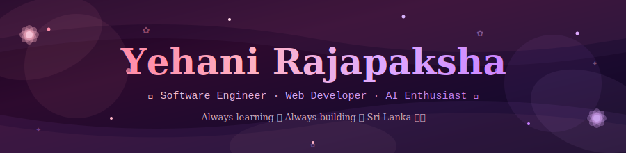
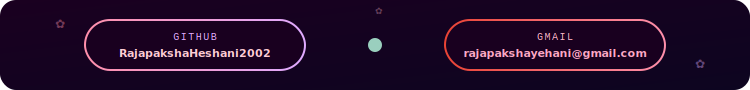

<div align="center">

<!-- ════════════════════════════════════════════════════════ -->
<!--                ANIMATED HEADER BANNER                  -->
<!-- ════════════════════════════════════════════════════════ -->



<br/>


<br/><br/>

<p>
  
  
  
  
</p>

</div>


<!-- ════════════════════════════════════════════════════════ -->
<!--                      ABOUT ME                          -->
<!-- ════════════════════════════════════════════════════════ -->

<div align="center">

## 🌸 About Me — Software Engineering Student

</div>

<table>
<tr>
<td width="55%" valign="top">

### 🎀 Professional Profile

```yaml
👤 Profile:
  Name: "Yehani Rajapaksha"
  Role: "Software Engineering Student"
  Location: "Sri Lanka 🇱🇰"
  Education: "ICBT Campus – Software Engineering"

🎓 Academic Background:
  Degree: "BSc (Hons) Software Engineering"
  Diploma: "IT Diploma – IMBS Green Campus"

💻 Core Skills:
  - Front-End Web Development
  - Full Stack Development
  - Web Application Development
  - Database Management
  - AI for Social Impact

🌸 Passions:
  - Web Development
  - Software Development
  - Artificial Intelligence
  - Building real-world projects

💼 Approach:
  - Continuous learner
  - Detail-oriented developer
  - Creative problem solver
  - Team-spirited collaborator
```

</td>
<td width="45%" align="center" valign="top">

### 🚀 Current Journey


<br/><br/>

**🎯 Learning Milestones:**

| Status | Goal |
|--------|------|
| ✅ | HTML, CSS & JavaScript |
| ✅ | PHP & MySQL Full Stack |
| ✅ | C# Desktop Development |
| ✅ | Java & Python Basics |
| 🔄 | Advanced Web Frameworks |
| 📋 | AI & Machine Learning |

<br/>

**💡 Philosophy:**

*"The best way to learn is to build. Every project is a new lesson."*

</td>
</tr>
</table>


<!-- ════════════════════════════════════════════════════════ -->
<!--                  SKILLS & TOOLS                        -->
<!-- ════════════════════════════════════════════════════════ -->

<div align="center">

## 🛠️ Skills & Technology Stack

### 💻 Programming Languages

<br/>



</div>

<br/>

<table>
<tr>
<td width="33%" valign="top">

**🌐 Web Development**
```
✅ HTML5 & Semantic Markup
✅ CSS3 & Responsive Design
✅ JavaScript (DOM, Events)
✅ PHP Backend Development
✅ MySQL Database Design
✅ Web App CRUD Operations
✅ Login & Auth Systems
✅ Form Validation
```

</td>
<td width="33%" valign="top">

**🖥️ Application Development**
```
✅ C# Desktop Applications
✅ Java Programming
✅ Python Scripting
✅ Android Studio (Basic)
✅ OOP Principles
✅ Database Integration
✅ UI Design & Layouts
✅ Software Documentation
```

</td>
<td width="34%" valign="top">

**🎓 Academic Knowledge**
```
📖 Software Engineering
📖 AI for Social Impact
📖 Front-End Web Dev
📖 Web Design Principles
📖 Python Programming
📖 Software Quality Assurance
📖 Cybersecurity Basics
📖 Agile Fundamentals
```

</td>
</tr>
</table>

<div align="center">

### 🧰 Tools & Platforms

<br/>

<p>
  
  
  
  
  
  
  
</p>

<br/>

**🔧 Technical Toolkit:**

| Category | Tools & Technologies |
|----------|---------------------|
| **Code Editors** | VS Code, Visual Studio 2022 |
| **Mobile Dev** | Android Studio |
| **Database** | MySQL, WampServer64 |
| **Version Control** | Git, GitHub |
| **Backend** | PHP, C#, Java, Python |
| **Frontend** | HTML5, CSS3, JavaScript |
| **Desktop** | C# with Visual Studio |
| **Documentation** | GitHub Markdown, Diagrams |

</div>


<!-- ════════════════════════════════════════════════════════ -->
<!--                     PROJECTS                           -->
<!-- ════════════════════════════════════════════════════════ -->

<div align="center">

## 🚀 Project Portfolio

<br/>



</div>

<br/>

### 🥦 Project 1: ManningHub — Web Management System

<table>
<tr>
<td width="60%">

**🎯 Project Overview:**
- **Type:** Web-Based Management System
- **Domain:** Vegetable Market Operations
- **Role:** Full Stack Developer

**🔬 Features Developed:**
- ✅ Product inventory management
- ✅ Sales tracking & reporting
- ✅ Vendor and buyer management
- ✅ Market data dashboard
- ✅ User authentication system
- ✅ CRUD operations for all modules
- ✅ Responsive web interface
- ✅ MySQL database integration

</td>
<td width="40%" valign="top">

**📊 Project Stats:**

```
Type:      Web Application
Backend:   PHP
Database:  MySQL
Frontend:  HTML, CSS, JS
Server:    WampServer64
Features:  8+ modules
```

**🛠️ Stack Used:**
- ✅ PHP (Backend Logic)
- ✅ MySQL (Database)
- ✅ HTML5 & CSS3 (UI)
- ✅ JavaScript (Interactivity)

</td>
</tr>
</table>

---

### 📚 Project 2: Sarasavi — Library Management System

<table>
<tr>
<td width="60%">

**🎯 Project Overview:**
- **Type:** Desktop Application
- **Platform:** Windows
- **Built With:** C# & Visual Studio 2022

**🔬 Features Developed:**
- ✅ Book catalogue management
- ✅ Member registration & profiles
- ✅ Borrow & return tracking
- ✅ Search & filter functionality
- ✅ Fine calculation system
- ✅ Reports & data summaries
- ✅ Admin dashboard
- ✅ Database-connected GUI

</td>
<td width="40%" valign="top">

**📊 Project Stats:**

```
Type:      Desktop App
Language:  C#
IDE:       Visual Studio 2022
Platform:  Windows
Pattern:   OOP
Modules:   6+ features
```

**🛠️ Stack Used:**
- ✅ C# (Core Language)
- ✅ Visual Studio 2022 (IDE)
- ✅ SQL Database
- ✅ Windows Forms UI

</td>
</tr>
</table>

---

### 🏫 Project 3: Private Campus Website

<table>
<tr>
<td width="60%">

**🎯 Project Overview:**
- **Type:** Web Application
- **Domain:** Education / Campus Portal
- **Role:** Full Stack Developer

**🔬 Features Developed:**
- ✅ User login & registration system
- ✅ Student profile management
- ✅ Search & filter functionality
- ✅ Update & delete operations
- ✅ Admin control panel
- ✅ Responsive mobile-friendly design
- ✅ Form validation (client & server)
- ✅ Session management

</td>
<td width="40%" valign="top">

**📊 Project Stats:**

```
Type:      Full Stack Web App
Frontend:  HTML, CSS, JavaScript
Backend:   PHP
Database:  MySQL
Features:  Full CRUD
Auth:      Login/Register
```

**🛠️ Stack Used:**
- ✅ HTML5, CSS3, JavaScript
- ✅ PHP (Server-Side)
- ✅ MySQL (Database)
- ✅ WampServer (Local Dev)

</td>
</tr>
</table>


<!-- ════════════════════════════════════════════════════════ -->
<!--                   GITHUB STATS                         -->
<!-- ════════════════════════════════════════════════════════ -->

<div align="center">

## 📊 GitHub Stats

<br/>


<br/><br/>


<br/><br/>

### 🏆 GitHub Trophies


### 📈 Contribution Activity


</div>


<!-- ════════════════════════════════════════════════════════ -->
<!--              LEARNING & DEVELOPMENT                    -->
<!-- ════════════════════════════════════════════════════════ -->

<div align="center">

## 📚 Learning & Development

</div>

<table>
<tr>
<td width="50%">

### 🎀 Courses & Certifications

| Status | Course | Provider | Area |
|:------:|--------|----------|------|
| ✅ | **Front-End Web Development** | Online | Web Dev |
| ✅ | **Web Design for Beginners** | Online | Design |
| ✅ | **Python for Beginners** | Online | Programming |
| ✅ | **AI for Social Impact** | Online | AI / ML |
| ✅ | **Intro to Software QA** | Online | Testing |
| ✅ | **Cybersecurity Basics** | Online | Security |
| 🔄 | **Advanced JavaScript** | In Progress | Web Dev |
| 📋 | **React Framework** | Planned | Frontend |
| 📋 | **Node.js & Express** | Planned | Backend |

### 🌱 Currently Learning

```javascript
const currentLearning = {
  frontend: [
    "Advanced CSS Animations",
    "JavaScript ES6+ Features",
    "Responsive Design Patterns",
    "UI/UX Fundamentals"
  ],
  backend: [
    "PHP Advanced Concepts",
    "RESTful API Design",
    "Database Optimization",
    "Server Management"
  ],
  future: [
    "React or Vue Framework",
    "Node.js Backend",
    "AI / Machine Learning",
    "Cloud Deployment"
  ]
};
```

</td>
<td width="50%">

### 🎯 Goals & Roadmap

**2024 – Foundation** ✅
- [x] Master HTML, CSS, JavaScript
- [x] Learn PHP & MySQL Full Stack
- [x] Build C# Desktop App
- [x] Study AI for Social Impact
- [x] Complete Cybersecurity course

**2025 – Growth** 🔄
- [x] Build web management projects
- [ ] Learn React or Vue.js
- [ ] Explore Node.js backend
- [ ] Deploy projects to cloud
- [ ] Contribute to open source

**2026 – Advanced** 📋
- [ ] Learn AI / ML fundamentals
- [ ] Build AI-powered web apps
- [ ] Freelance web projects
- [ ] Internship / Junior Dev role
- [ ] Advanced mobile development

<br/>

### 📖 Learning Resources

- 🎥 YouTube: Traversy Media, FreeCodeCamp
- 📝 Docs: MDN Web Docs, W3Schools
- 💻 Practice: GitHub, CodePen
- 👥 Communities: Stack Overflow, Dev.to
- 🎙️ Courses: Udemy, Coursera

</td>
</tr>
</table>


<!-- ════════════════════════════════════════════════════════ -->
<!--                  CONNECT SECTION                       -->
<!-- ════════════════════════════════════════════════════════ -->

<div align="center">

## 🌸 Let's Connect & Collaborate

<br/>

### 📫 Reach Out to Me

<br/>



<br/><br/>

<p>
  <a href="mailto:rajapakshayehani@gmail.com">
    
  </a>
  <a href="https://github.com/RajapakshaHeshani2002">
    
  </a>
</p>

<br/>

### 💼 Open to Opportunities

<table>
<tr>
<td align="center" width="25%">
<h3>🌸</h3>
<b>Internships</b><br/>
<sub>Software Dev roles</sub>
</td>
<td align="center" width="25%">
<h3>🌐</h3>
<b>Web Projects</b><br/>
<sub>Freelance & collab</sub>
</td>
<td align="center" width="25%">
<h3>🎓</h3>
<b>Study Groups</b><br/>
<sub>Learn together</sub>
</td>
<td align="center" width="25%">
<h3>🤝</h3>
<b>Open Source</b><br/>
<sub>Contribute & grow</sub>
</td>
</tr>
</table>

<br/>

### 🌟 What I Bring

```typescript
const yehaniValue = {
  strengths: [
    "🌐 Full stack web development skills",
    "💡 Creative problem-solving mindset",
    "📚 Passionate about continuous learning",
    "🤝 Team-oriented and collaborative",
    "🎯 Detail-focused and quality-driven",
    "🚀 Fast learner with strong work ethic"
  ],
  workStyle: {
    approach: "Systematic and creative development",
    communication: "Clear, friendly, and professional",
    attitude: "Growth mindset, always improving",
    teamwork: "Supportive and enthusiastic"
  },
  availability: {
    status: "Open to internships & collaborations",
    location: "Remote or On-site (Sri Lanka)",
    type: ["Internship", "Part-time", "Freelance", "Collaboration"]
  }
};
```

</div>


<!-- ════════════════════════════════════════════════════════ -->
<!--                MOTIVATION & QUOTES                     -->
<!-- ════════════════════════════════════════════════════════ -->

<div align="center">

## 💭 Daily Motivation


<br/><br/>

### 🌸 My Development Philosophy

> *"Every expert was once a beginner. Every pro started where you are."*

> *"Code is like art — the more you practice, the better it gets."*

> *"Build something that makes a difference, no matter how small."*

</div>


<!-- ════════════════════════════════════════════════════════ -->
<!--                SNAKE CONTRIBUTION                      -->
<!-- ════════════════════════════════════════════════════════ -->

<div align="center">

## 🐍 Contribution Activity

<picture>
  <source media="(prefers-color-scheme: dark)" srcset="https://raw.githubusercontent.com/platane/snk/output/github-contribution-grid-snake-dark.svg">
  <source media="(prefers-color-scheme: light)" srcset="https://raw.githubusercontent.com/platane/snk/output/github-contribution-grid-snake.svg">
  
</picture>

</div>


<!-- Footer Wave -->


<div align="center">

### 🌸 Thank You for Visiting! 🌸


<br/>

**"Always learning, always building — one project at a time 🚀"**

<br/>

<sub>🌸 If you find my profile interesting, give it a star!</sub><br/>
<sub>💜 Open to collaborations, internships & learning opportunities</sub><br/>
<sub>📧 Contact: rajapakshayehani@gmail.com</sub>

<br/>


<br/><br/>

---

<sub>Made with 🌸 by Yehani Rajapaksha &nbsp;·&nbsp; Software Engineer &nbsp;·&nbsp; Sri Lanka 🇱🇰</sub>

</div>
